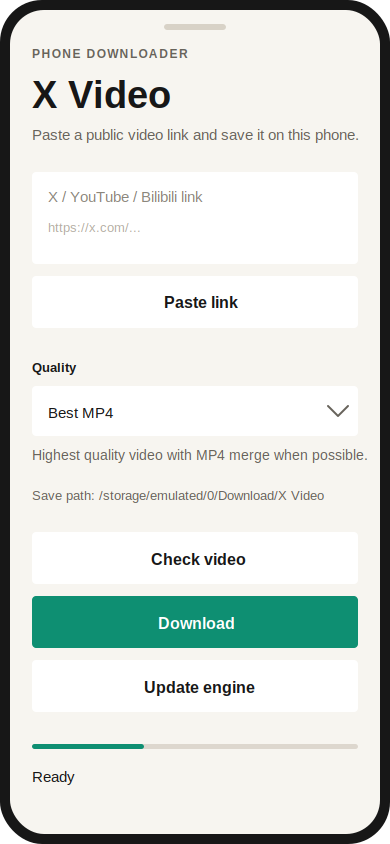

# X Video Downloader

A local web app plus standalone Android and macOS apps for downloading videos from public X, YouTube, and Bilibili pages.

Use it only for videos you own or have permission to save.



## Features

- Local desktop web UI for parsing and downloading public videos.
- Standalone Android app that downloads directly on the phone.
- Standalone macOS app that bundles `yt-dlp` and `ffmpeg`.
- Phone downloads are saved to `Download/X Video/`.
- Mac downloads are saved to `~/Downloads/X Video/`.
- Supports X/Twitter, YouTube, and Bilibili links.
- Quality presets include best MP4, 1080p, 720p, and MP3 audio.
- Built on `yt-dlp`; the Android app can update its bundled engine from the app UI.

## Requirements

- Python 3.10+
- `yt-dlp`
- `curl-cffi`
- `ffmpeg` recommended for highest-quality video/audio merging

## Setup

```bash
python3 -m venv .venv
.venv/bin/pip install -r requirements.txt
```

Install `ffmpeg` if you want best video + best audio merging:

```bash
brew install ffmpeg
```

## Run

```bash
.venv/bin/python server.py
```

Open `http://127.0.0.1:8765`.

Default login:

- Username: `admin`
- Password: `admin234`

Downloads are saved into `downloads/` by default.

When exposing the app outside your LAN, change the login values before starting the server:

```bash
export VIDEO_DOWNLOADER_USER="your-user"
export VIDEO_DOWNLOADER_PASSWORD="your-strong-password"
export VIDEO_DOWNLOADER_SECRET="a-long-random-session-secret"
.venv/bin/python server.py
```

## Android App

The Android project lives in `android/` and does not replace the existing web app.

Open `android/` in Android Studio and run the `app` configuration, or download a release APK from GitHub Releases when available.

The Android app saves videos on the phone at:

```text
/storage/emulated/0/Download/X Video
```

## macOS App

The macOS project lives in `ios/` and is built with SwiftUI. It does not require the local Python service.

Open `ios/XVideoIOS.xcodeproj` in Xcode and run the `XVideoIOS` scheme on `My Mac`, or download the macOS DMG from GitHub Releases.

The release app bundles `yt-dlp` and `ffmpeg`. Downloads are saved to `~/Downloads/X Video/` by default.

## Deploying to Vercel

This repo includes `api/index.py`, `app.py`, and `vercel.json` so Vercel can detect a Python Serverless Function entrypoint. The Vercel config intentionally avoids a custom `functions` pattern so Vercel can auto-detect the Python function.

Vercel is useful for hosting the UI and lightweight format parsing, but the full downloader is designed for local use. Cloud deployments cannot open a folder picker on your computer, save files into your local filesystem, or reliably keep long background downloads alive after the request ends.

## Notes

- Paste an X, YouTube, or Bilibili link, parse the available resolutions, then choose the quality to download.
- Set the save directory in the page. Relative paths are resolved from the project folder.
- When subtitles are available, the page lets you choose whether to download them and which language to request.
- Completed files are named as `<page title>-<resolution>.<ext>`.
- Some videos require login. In that case, select the browser whose cookies contain your logged-in session.
- The app runs locally and binds to `127.0.0.1` by default.
- The web UI is protected by a signed cookie login session.
